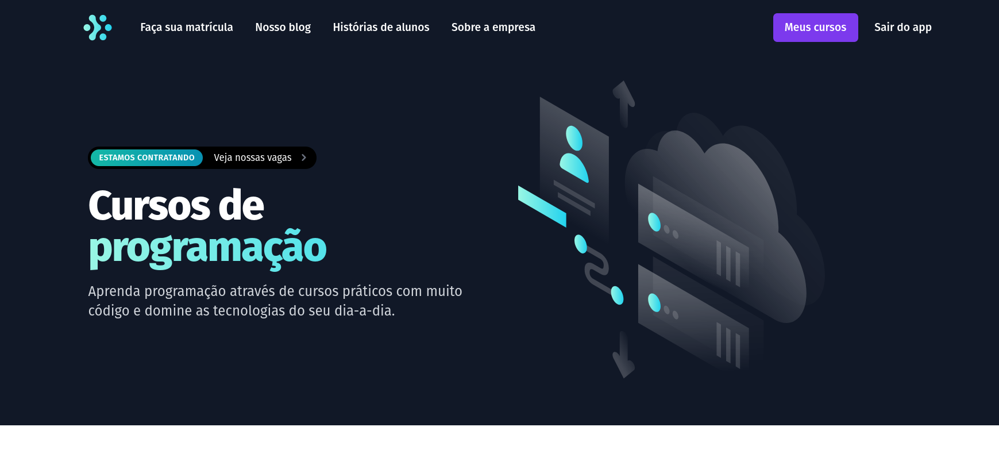
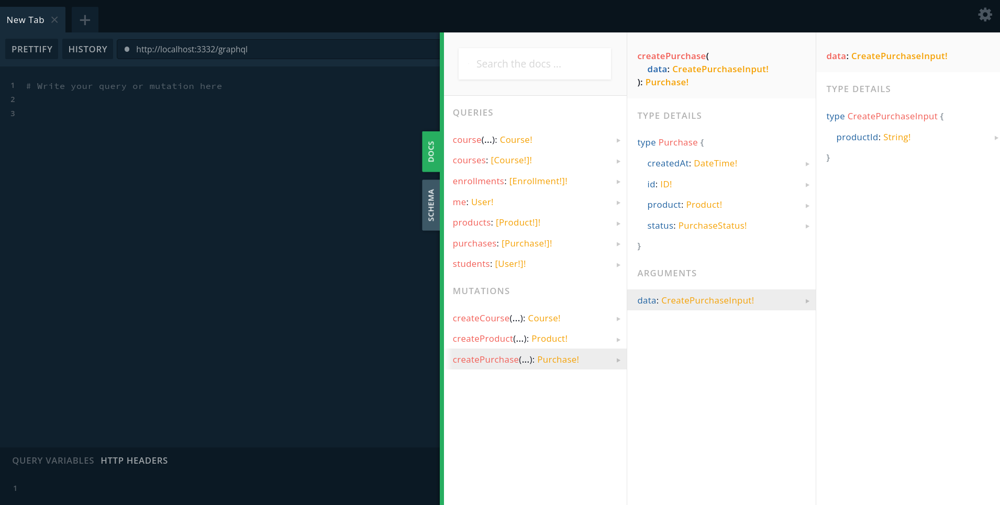

# ignite_lab -> Microservices

## 🚀 Tecnologias

- [TypeScript](https://www.typescriptlang.org/)
- [Prisma](https://www.prisma.io/)
- [NestJS](https://nestjs.com/)
- [Next](https://nextjs.org/)
- [Auth0](https://auth0.com/)
- [Kafka](https://kafka.apache.org/)
- [Apollo Client - GraphQL](https://www.apollographql.com/docs/react/)

## 🔖 Frontend layout

  

## GraphQL Queries

Documentação de queries gerada automaticamente para os dois serviços na porta do gateway:

  

## Funcionalidades dos serviços:

### Serviço de compras (purshases)

- [Admin] Cadastro de produtos.
- [Admin] Listagem de produtos.
- [Auth] Listagem de compras.
- [Public] Compra de um produto.
- [Public] Lista de produtos disponíveis para compra.

### Serviço de sala de aula (classroom)

- [Admin] Listar matrículas.
- [Admin] Listar alunos.
- [Admin] Listar cursos.
- [Admin] Cadastrar alunos.
- [Auth] Listar cursos que tenho acesso.
- [Auth] Acessar conteúdos do curso.

## 📝 License

This project is licensed under the MIT License - see the [LICENSE](LICENSE) file for details.

## Referencias

[Rocketseat - Ignite lab](https://www.rocketseat.com.br/)
